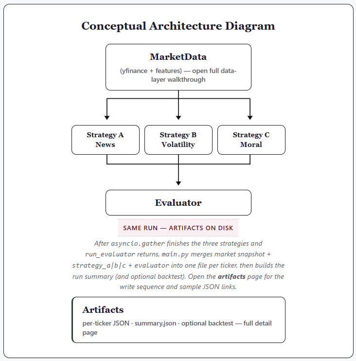

# AGAI_HW2 — StockTrader (Individual Assignment 2)

Multi-agent stock signal system for course submission. This README is structured so graders can verify requirements quickly.

## Course Requirements (Grading Checklist)

- [x] **Two graded strategies** — **News Sentiment Follower** (`strategy_a`) and **Volatility Averse** (`strategy_b`). Moral Trader is the optional third agent. Prompts: [`prompts/`](prompts/). Rationale: [Strategy selection](#strategy-selection).
- [x] **LLM provider** — **Ollama** (local). Optional **LiteLLM**-compatible proxy via `LITELLM_*` env vars. Details: [Environment variables](#environment-variables).
- [x] **Framework / toolset** — **Microsoft AutoGen** (`AssistantAgent`, structured outputs), **Python 3.10+**, **yfinance**, optional **Alpha Vantage** news. Overview: [Architecture (brief)](report/walkthrough/StockTrader_Walkthrough_Home.html).
- [x] **Install and run** — [Before you begin](#before-you-begin) and [Run](#run).
- [x] **Pre-generated outputs** — Committed JSON under [`outputs/`](outputs/) so the project **runs for grading without** an Alpha Vantage key (news blocks may be empty; pipeline still completes). Re-run locally with a key for live news if desired.

### Latest committed empirical snapshot (`outputs/summary.json`)

| Metric | Value |
|--------|--------|
| Tickers | `PLTR`, `TTE`, `GOLD`, `LMT`, `FRO` |
| `total_agreements` | **1** (three agents all agree on **one** symbol: **GOLD** → SELL) |
| `total_disagreements` | **4** |
| Heuristic backtest (see `outputs/backtest.json`) | `overall_hit_rate_news` **0.4348**, `overall_hit_rate_volatility` **0.2522**, `overall_winner` **news_sentiment_heuristic** |

Narrative analysis: [`report/comparative_analysis.tex`](report/comparative_analysis.tex) (build PDF per course instructions). Pull the latest `master` to match tables and quotes to JSON on disk.

---

## Repository layout (top level)

| Path | Purpose |
|------|---------|
| [`src/`](src/) | Application code: CLI, market data, orchestration, strategies, evaluator, backtest. |
| [`prompts/`](prompts/) | Saved strategy and evaluator prompts (text files for grading). |
| [`outputs/`](outputs/) | Per-ticker JSON, `summary.json`, optional `backtest.json` (sample outputs included). |
| [`report/`](report/) | Written analysis (LaTeX, defense universe note, optional HTML walkthrough under `report/walkthrough/`). |
| [`requirements.txt`](requirements.txt) | Python dependencies. |
| [`.env.example`](.env.example) | Example environment file (copy to `.env`, not committed). |

**Local-only folders (not in this repository):** `docs/`, `scripts/`, `logs/`, and `secrets/` are gitignored—create them on your machine if you want supplemental notes, helper scripts, run transcripts, or a separate key file layout. Grading uses the committed tree above plus `outputs/`.

---

## Strategy selection

- **News Sentiment Follower** — Emphasizes headlines and sentiment when present; conservative fallbacks when news is missing.
- **Volatility Averse** — Emphasizes realized turbulence, drawdown depth, and stability of the tape.
- **Moral Trader** (extension) — Third parallel branch; evaluated after A and B complete for the same ticker.

Default tickers: `PLTR`, `TTE`, `GOLD`, `LMT`, `FRO` (defense / geopolitics / AFRICOM-aware basket). Override with `--tickers A,B,C`.

---

## Before you begin

1. **Python** 3.10+ (3.12 recommended). [python.org](https://www.python.org/downloads/)
2. **Virtual environment** (repo root):  
   `python -m venv .venv` then `.\.venv\Scripts\Activate.ps1` (Windows PowerShell)
3. **Dependencies:** `pip install -r requirements.txt`
4. **Ollama** — [ollama.com](https://ollama.com); pull a JSON-capable model, e.g. `ollama pull llama3.2`. Ensure the daemon is running (`http://localhost:11434` by default).
5. **Alpha Vantage (optional)** — Improves news blocks; not required to execute the pipeline. Set `ALPHAVANTAGE_API_KEY` in repo-root `.env` (copy from `.env.example`).
6. **Copy** `.env.example` → `.env` and adjust variables as needed.

---

## Environment variables

| Variable | Purpose |
|----------|---------|
| `OLLAMA_HOST` | Default `http://localhost:11434` |
| `OLLAMA_MODEL` | e.g. `llama3.2` |
| `OLLAMA_NUM_PREDICT` | Max tokens per call (default `220`) |
| `OLLAMA_NUM_CTX` | Context window (default `4096`) |
| `OLLAMA_TEMPERATURE` | Sampling temperature (default `0.2`) |
| `ALPHAVANTAGE_API_KEY` | [NEWS_SENTIMENT](https://www.alphavantage.co/documentation/) |
| `ALPHAVANTAGE_NEWS_LIMIT` | Optional; max articles (1–1000), default 20 |
| `ALPHAVANTAGE_NEWS_SORT` | Optional: `LATEST`, `EARLIEST`, `RELEVANCE` |
| `ALPHAVANTAGE_MIN_INTERVAL_SEC` | Optional; spacing between AV HTTP calls |
| `LITELLM_BASE_URL` | If set, use OpenAI-compatible client (LiteLLM proxy) |
| `LITELLM_MODEL` | Model id for proxy |
| `LITELLM_API_KEY` | Proxy API key if required |
| `STOCKTRADER_SKIP_LLM` | `1` to stub LLM outputs (CI / smoke tests) |

---

## Run

From the repository root:

```powershell
.\.venv\Scripts\Activate.ps1
pip install -r requirements.txt
$env:PYTHONPATH = (Get-Location).Path
python -m src.main --backtest
```

Artifacts: `outputs/<TICKER>.json`, `summary.json`, optional `outputs/backtest.json` when `--backtest` is passed.

For submission-quality narratives, clear stubs and run with Ollama available:

```powershell
Remove-Item Env:STOCKTRADER_SKIP_LLM -ErrorAction SilentlyContinue
$env:PYTHONPATH = (Get-Location).Path
python -m src.main --backtest
```

**Remote:** [https://github.com/afro-chai/AGAI_HW2-IndividualAssignment-Coding](https://github.com/afro-chai/AGAI_HW2-IndividualAssignment-Coding)

---

## [Architecture (brief)](report/walkthrough/StockTrader_Walkthrough_Home.html)

Static HTML walkthrough (open [`report/walkthrough/StockTrader_Walkthrough_Home.html`](report/walkthrough/StockTrader_Walkthrough_Home.html) from a clone): clickable pipeline diagram, full repository layout with links, and strategy / evaluator canvases. The figure below matches the conceptual diagram on that page.

The runtime is a **Python package under `src/`** driven by `python -m src.main`. **`market_data.build_market_payload`** (no LLM) assembles OHLC-derived features and optional Alpha Vantage `NEWS_SENTIMENT` into one JSON object per ticker. **`orchestration`** schedules work with a per-ticker semaphore and, inside each ticker, **`asyncio.gather`** over three AutoGen **`AssistantAgent`** calls—each loads a prompt from **`prompts/*.txt`** and returns a **Pydantic** `StrategyStructured` instance defined in **`schemas.py`**. **`llm_factory`** supplies the Ollama (or optional LiteLLM-compatible) client. After all three structured outputs exist, **`evaluator.run_evaluator`** runs a fourth LLM pass with branch-specific instructions; **`pattern_note`** is then **overwritten deterministically** from the three decisions. **`main`** merges market data, strategies, and evaluator into **`outputs/<TICKER>.json`**, writes **`summary.json`**, and optionally **`backtest.py`** → **`outputs/backtest.json`**.

**Conceptual pipeline** — one market payload per ticker, three parallel strategies, evaluator, then artifacts on disk:



**Python modules**

- **`src/market_data.py`** — yfinance features and optional Alpha Vantage news (one `NEWS_SENTIMENT` call per ticker per run when configured).
- **`src/llm_factory.py`** — Ollama or LiteLLM-backed chat client.
- **`src/orchestration.py`** — Three `AssistantAgent` instances per ticker, `asyncio.gather`; evaluator pass.
- **`src/evaluator.py`** — Compares structured strategy outputs; branch-specific instructions for agreement vs disagreement; deterministic `pattern_note` from decisions.
- **`src/backtest.py`** — Deterministic historical scorecard (heuristic proxies vs forward returns), optional with `--backtest`.
- **`prompts/*.txt`** — Saved prompts for grading.

---

## Project productivity checkpoints

Use as a personal progress list (not required for graders):

- [x] **C0 — Environment** — Python venv, `pip install -r requirements.txt`, Ollama model pulled.
- [x] **C1 — Market data** — `market_data.py` returns history + volatility + optional AV news; handles empty news.
- [x] **C2 — AutoGen strategies** — Three agents, parallel execution, structured JSON; no cross-talk before evaluation.
- [x] **C3 — Evaluator** — Agreement vs split narrative; saved in JSON.
- [x] **C4 — Tickers + JSON** — Default five `outputs/*.json` + `summary.json`; written report.
- [x] **C5 — Backtest** — `outputs/backtest.json` when using `--backtest`.
- [x] **C6 — Report PDFs** — `report/comparative_analysis.tex` → `report.pdf`; AI use appendix per course.
- [x] **C7 — GitHub** — Pushed `master` with README and `requirements.txt`.
