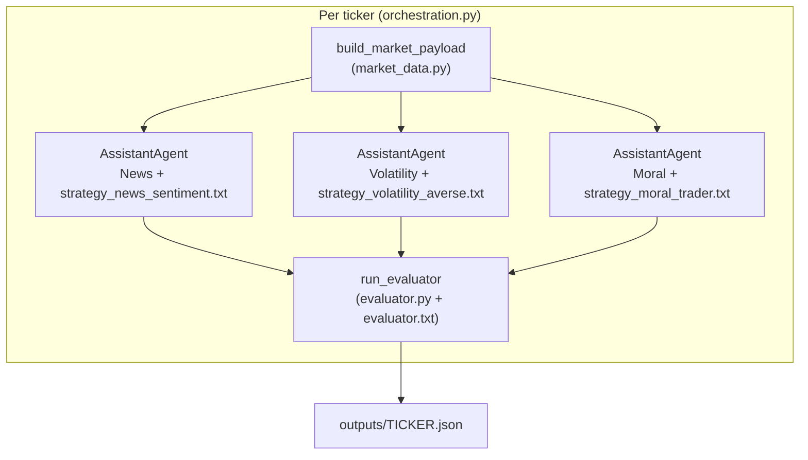

# `src/` — StockTrader implementation

Python package for **HW2 StockTrader**: one market JSON per ticker, **three parallel AutoGen `AssistantAgent` strategies**, then an **evaluator** pass. Grades see runnable code here; **visual walkthrough** (HTML, same architecture as the report’s TikZ figure): [`../report/walkthrough/StockTrader_Walkthrough_Home.html`](../report/walkthrough/StockTrader_Walkthrough_Home.html) (open in a browser from the repo clone).

---

## Execution flow (per ticker)

1. **`main.py`** — Parses `--tickers`, `--backtest`, `--ticker-workers`; loads `.env`; runs `asyncio.run` on an inner coroutine that `asyncio.gather`s one coroutine **per ticker** (each ticker is independent).
2. **`orchestration.run_parallel_analysis(ticker)`** — Calls `build_market_payload(ticker)` (async wrapper around sync I/O), builds the user message from `strategies.user_message_from_payload`, then runs **three** `_run_one_strategy` coroutines **in parallel** (`asyncio.gather`), then **`run_evaluator`** with the three structured dicts.
3. **Strategies** — Each agent: `AssistantAgent` + `system_message` from `prompts/strategy_*.txt` + `StructuredMessage` with `StrategyStructured` (Pydantic): `decision`, `confidence`, `justification`.
4. **Evaluator** — `run_evaluator` builds a **branch-specific** natural-language task (`evaluator.py` + `prompts/evaluator.txt`): full agreement vs graded-pair agreement vs graded disagreement. **`pattern_note` is computed in code** from the three decisions (never hallucinated).

```text
  main.py
     │
     ├─► asyncio.gather( _one(ticker) for each ticker )   ← concurrency across tickers (Semaphore)
     │
     └─► _one(ticker):
            build_market_payload(ticker)
                 │
                 ├──────────────┬──────────────┐
                 ▼              ▼              ▼
            Strategy A     Strategy B     Strategy C     (asyncio.gather — no cross-read)
            (News)         (Volatility)    (Moral)
                 │              │              │
                 └──────────────┴──────────────┘
                                │
                                ▼
                         run_evaluator([a,b,c])
                                │
                                ▼
                         outputs/<TICKER>.json
```

---

## Module map

| Module | Role |
|--------|------|
| `main.py` | CLI, `DEFAULT_TICKERS`, summary aggregation, optional `run_backtest` → `backtest.json`. |
| `market_data.py` | yfinance OHLC → `market_data_summary`; optional Alpha Vantage `NEWS_SENTIMENT` → `news_features`. |
| `orchestration.py` | Wires three `AssistantAgent`s + shared payload; `asyncio.gather` for strategies. |
| `strategies.py` | `load_prompt`, `user_message_from_payload` (JSON text for the LLM). |
| `schemas.py` | Pydantic `StrategyStructured`, `EvaluatorStructured`. |
| `llm_factory.py` | `OllamaChatCompletionClient` or OpenAI-compatible client when `LITELLM_*` set. |
| `evaluator.py` | Branching evaluator task, unanimity detection, deterministic `pattern_note`. |
| `backtest.py` | Historical heuristic scorecard (`_signal_news_proxy`, `_signal_vol_averse`) — **no** LLM on history. |

---

## Logic diagram (data + control)



**Isolation invariant:** strategies **only** receive the market payload string; they do **not** receive each other’s messages until the evaluator runs **after** all three structured outputs exist.

---

## Backtest path (`--backtest`)

After all tickers finish, `main.py` calls `run_backtest(tickers)` which loops weekly as-of dates, builds point-in-time payloads via `market_payload_asof`, applies **deterministic** heuristics in `backtest.py` (not the LLM), writes `outputs/backtest.json`. Same default tickers as the live run unless overridden.

---

## Where to read next

- **Prompts (grading artifacts):** [`../prompts/`](../prompts/)
- **HTML walkthrough (diagrams):** [`../report/walkthrough/`](../report/walkthrough/)
- **LaTeX architecture figure:** `report/comparative_analysis.tex` (TikZ diagram mirroring the walkthrough home page)
